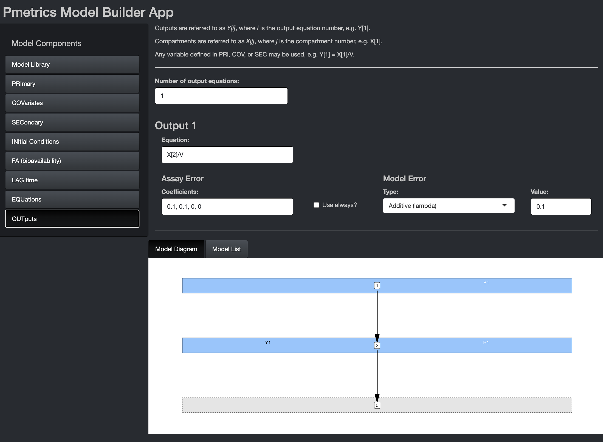

```{r setup, include=FALSE, context="server"}
library(learnr)
library(LearnPM)
library(Pmetrics)
library(tidyverse)
library(gradethis)
gradethis::gradethis_setup()
knitr::opts_chunk$set(echo = TRUE)
#wd<-tempdir()

#run_wd = paste0(wd,"/Runs")
#dir.create(run_wd)

exData <- dataEx
mod1 <- modEx
exFit <- PM_fit$new(model = modEx, data = dataEx)

#exData$write("data.csv")
#file_content <- readLines("data.csv")
#file_content <- file_content[-1]
#writeLines(file_content, "data.csv")
#mod1$write("model.txt")
```

# About this tutorial

Welcome to the Pmetrics model fitting tutorial. This tutorial will briefly introduce you to the R programming language and the Pmetrics modeling framework.
The main topics of this tutorial are:

- Create and manipulate `PM_data` and `PM_model` objects.
- Use those objects to create a `PM_fit` object.
- Learn how to interact with the `PM_fit` object and execute it.
- Interact with the `PM_result` object.

`r colorize("NOTE: ", "red")` to open hyperlinks in a new tab:

* Mac: `r knitr::asis_output("\U2318")` + click
* Windows/Linux: Ctrl + click

## R and Pmetrics basics

This is by no means an exhaustive R [tutorial](https://www.w3schools.com/r/).
We will only cover the basics needed to execute Pmetrics and work through the tutorial.

R is an [interpreted](https://en.wikipedia.org/wiki/Scripting_language), dynamic-typed, object oriented programming language, it is mainly used by data scientist and researchers around the world to perform data analysis, statistical inference, data visualization, and even artificial intelligence.

At any point, you can get help by typing
?function_name in the R console (the lower left window pane in RStudio).

Try getting help for plot.PM_op().

```{r function_help, exercise=TRUE, exercise.completion = FALSE}

```


```{r function_help-hint}
#You don't need to include the parentheses when asking for help.
```

```{r function_help-solution}
?plot.PM_op
```

When you begin an R script you must always load Pmetrics, because the
data and functions in the package are not automatically available to you
when you start R/Rstudio. You don't need to execute the following
command in this tutorial because we've done it for you already, but you
should include it in every Pmetrics script of your own.

```{r echo = T, eval = F}
library(Pmetrics)
```

## Script structure and comments

As you develop R scripts that have your analyses, it is useful to annotate with
comments so that you can remember what you did later! Comment lines in R begin
with "#". A script might look like this.

```{r eval = FALSE}
library(Pmetrics)

# Run 1 - tlag, ka, kel, vol
setwd("My_project/src")
dat <- PM_data$new("data.csv")
mod <- PM_model$new("model.txt")

setwd("My_project/Runs")
fit <- PM_fit$new(dat, mod)
fit$run(intern = TRUE)

run1 <- PM_load(1)
# more code...

# Run 2 - change parameter ranges.

# more code...

# Run 3...
# ...

```

Don't worry about the details now. We'll cover all this in the tutorial.
In your scripts, including in the above example, you will need to tell R which
directory your files are in. This is called the "working directory" in R.


Include the full path or path relative to your current working directory
in quotes between the parentheses. Windows users: Make sure that you
separate directories with a forward slash "/" or double backslashes
"\\\\". Unfortunately, Windows is the only OS that uses backslashes
"\\", so R conforms to Unix/Linux style.

Examples:

- "\~/LAPKB/Pmetrics/Examples" for Mac/Linux users
- "C:/LAPKB/Pmetrics/Examples" for Windows users

If that sets the working directory, how do you get the current working directory?

```{r}

getwd() #the current working directory of this tutorial

```

## Data object

```{r, echo = FALSE, results = 'hide'}

```

Pmetrics always needs data and a model, so for our run let's first
create our data object.

You can most easily create a new data object by reading a file that you
made. You can read more details on [data file format](https://lapkb.github.io/Pmetrics/articles/data.html).
Here we give you a file in the tutorial Examples/src folder. In
your own project directories, you can look at this file directly by
opening it in a spreadsheet program like Excel, or a text editor. To read the
file into Pmetrics, use the code below.

```{r eval = FALSE}
exData <- PM_data$new("filename") #create a new PM_data object by reading a file
```

we have prepared a file named `data.csv` in the data folder to serve as an example, let's take a look at it:

```{r read_raw_data, exercise = TRUE}
read.csv("data/data.csv")
```

Further information about the Pmetrics data format can be found [here](https://lapkb.github.io/Pmetrics/articles/data.html).

Now, you try reading the `data.csv` file from the data folder and call the result
exData.

```{r read_data, exercise = TRUE}

```

```{r read_data-solution}
exData <- PM_data$new("data/data.csv")
```


When you create a `PM_data` object, you see a report of any
standardizations or fixes Pmetrics attempted. In this case (of course),
everything passed. `exData` is an R6 object, which means that it
contains both _fields_ containing data and _methods_ to process that
data. In R6, fields and methods are accessed with the `$`.

To look at the structure of an object:

```{r names_data, exercise = TRUE}
str(exData)
```

You see the classes (`PM_data` and `R6`), and public bins which are
either functions (methods) or data (fields). Private bins are not
user-accessible, but are internal to R6 objects, often, as in this case,
to validate the object. This is the advantage of the R6 framework, which
is object oriented over the older but more common S3 framework in R.
Object oriented means that objects contain both the data and the methods
to work on that data, ensuring a more stable environment than where
functions and data are separate and therefore not necessarily
compatible.

Imagine if you have an object
`my_vector <- c("apples","pears","bananas")` and you tried to do
`mean(my_vector)`. That is the S3 way and how legacy Pmetrics worked.
Under R6, you would have an object that only accepted numerical data and
contained the function to calculate the mean, e.g. `my_R6_object$data`
and `my_R6_object$mean()`. Note that to activate methods, you still need
the parentheses, just like for functions in R.

So here is the way to see the original data field in our R6 PM_data
object called `exData`.

```{r original_data, exercise = TRUE, }
exData$data #original data
```

Or the standard data...

```{r standard_data, exercise = TRUE}
exData$standard_data #contains the standardized and validated data
```

And here's how we can summarize it.

```{r summary_data, exercise = TRUE}
exData$summary() #a method to summarize the data
```

For comparison, the same thing in the more common S3 framework in R:

```{r summary_data_legacy, exercise = TRUE}
summary(exData) #the S3 function to summarize the data
```

The output is the same, but the way of getting it differs between R6 and
S3.

Other examples of things that can be done with this object are

```{r eval = F}
exData #view the original data in the viewer
exData$print(standard = T) #view the standardized data in the viewer
exData$print(viewer = F) #view original data in console
```

You can always learn more by typing `?PM_data` into your R console or by looking at its [documentation](https://lapkb.github.io/Pmetrics/reference/PM_data.html#methods).

Now, you try plotting exData

```{r plot_data, exercise = TRUE}

```

```{r plot_data-solution}
exData$plot()
```

## Model object

### Model Library

[`PM_model`](https://lapkb.github.io/Pmetrics/reference/PM_model.html) objects are used as a representation of one specific model we want to fit to the data. It also contains some methods attached to it, but in this tutorial we will mainly focus on the different ways to create them.

The easiest way to build models is to use the Pmetrics Model Builder
[App](https://lapkb.github.io/Pmetrics/reference/build_model.html).
It can't be displayed within this tutorial, but you can keep the
tutorial open while you play with the app. To launch the app, type the
following into your console: `build_model(exData)`. This will start
the app with sample data that is the same as what we created with
`exData`. When you launch it, the first page you'll see is below.

Navigate with the model components sidebar.

```{r echo = FALSE, out.width="75%", out.height="75%"}
knitr::include_graphics("images/model_builder/front.png")
```

Here you can choose from pre-existing models, either which you have
created yourself and load with the Previous Model dialogue, or from the
Pmetrics Model Library. Use the filters and description search to help
select the model you want. Matching models will update in the box at the
bottom. If you select one, you'll see a model snapshot on the right.

In the snapshots, B is for bolus inputs, R is for Rate infusions (e.g.
intravenous infusions), and Y is for observations. Arrows indicate the
flow of drug. The grey compartment 0 is the environment.

Once you choose a model, hit the "Select" button at the bottom to
populate remaining model components. Similarly, if you load a Previous
Model, model components will be appropriately populated.

**For this tutorial, choose the model with oral absorption and two
compartments as shown in the snapshot above.**

#### PRImary

```{r echo = FALSE, out.width="75%", out.height="75%"}

```

In this tab, you can choose the number and names of the primary
parameters. These are the parameters for which value probability
distributions will be estimated. You can specify initial values as
ranges or mean/SD. The mean is the mid point of a range and the SD is
1/6 of the range, i.e. 3 SD above and below the mean. If you omit the
second value for a parameter (Max or SD), the parameter will become
"fixed", i.e. unknown value but zero variance in the population. In
other words Pmetrics will estimate the value but make it the same for
the whole population. The value you provide will be the starting
estimate. If you check the constant option, it will fix the parameter to
your value for every subject and not estimate. The GTZ option keeps the
parameter positive, which is only relevant for parametric analysis,
since nonparametric will respect parameter ranges strictly.

In the bottom you see the Model Diagram and the Model List. These
dynamically build as you complete the Model Components. More about them
later.

**Make your PRImary component match the image in the tutorial.**

#### COVariates

```{r echo = FALSE, out.width="75%", out.height="75%"}
knitr::include_graphics("images/model_builder/covariates.png")
```

If you launch the Model Builder with a [`PM_data`](https://lapkb.github.io/Pmetrics/reference/PM_data.html) object as an argument,
the covariate tab will be pre-populated with the covariates in the data
file, as above. You can select any of them to make them piece-wise
constant, i.e. the value is held constant between measurements. If left
unchecked, covariate values will be linearly interpolated between
measurements.

**Make your COVariate component match the image in the tutorial.**

```{r quiz, echo = FALSE}

question("Which of the following covariates in a model of ceftazidime in intermittent hemodialysis would be most likely to be checked as piece-wise constant?",
         answer("weight"),
         answer("dialysis", correct = TRUE),
         answer("creatinine"),
         answer("potassium"),
         correct = "Yes, dialysis can be turned on or off with 1 or 0 values which will be constant until changed.",
         incorrect = "No, try again. This covariate should be allowed to change between measurements.",
         allow_retry = TRUE
)

```

#### SECondary

```{r echo = FALSE, out.width="75%", out.height="75%"}
knitr::include_graphics("images/model_builder/secondary.png")
```

Secondary variables are those that are defined by equations that are
combinations of primary, covariates, and other secondary variables. If
using secondary variables, define them first within this block. It is
permissible to have conditional statements, but because expressions in
this block are translated into variable declarations, expressions other
than of the form "X = function(Y)" must be on a new line, prefixed by
"&" and contain only variables which have been previously defined in the
Primary, Covariate, or Secondary blocks.

The image shows examples of secondary variable declarations without
conditions. Here are two examples of conditional secondary variables
chosen on the basis of sex. The primary variables are Vm, Vf, CLm, and
CLf.

```
V = Vm
&IF(sex == 1) V = Vf

V = Vm
CL = CLm
&IF(sex == 1) THEN
V = Vf
CL = CLF
ENDIF
```

**Make your SECondary component blank for the tutorial.**

#### INItial conditions

In this tab you can change the default initial condition of any
compartment from 0 to something else. It can be an equation, primary or
secondary variable, or covariate. We'll discuss more about the interface
in the section on lag times.

#### FA (bioavailability)

In this tab you can change the default bioavailability of any bolus
input from 1 to something else. It can be an equation, primary or
secondary variable, or covariate. We'll discuss more about the interface
in the section on lag times.

#### LAG time

```{r echo = FALSE, out.width="75%", out.height="75%"}
knitr::include_graphics("images/model_builder/lag.png")
```

In this tab you can change the default delay in absorption of any bolus
input from 0 to something else. It can be an equation, primary or
secondary variable, or covariate. If you wish to use any of the latter
three, select them from the drop down and the equation will
pre-populate, as shown in the image. You can edit the equation or write
your own equation. This is true for initial conditions and
bioavailability in their tabs.

**Make your LAG time component match the image in the tutorial.**

#### EQuatioNs

```{r echo = FALSE, out.width="75%", out.height="75%"}

```

Here you specify the equations that define the structural model, i.e., the
mathematical expressions that relate input (dose) to output (measurements).
Use `dX[i]` for change in compartment amounts, where i is the compartment number,
e.g. dX[1] or dX[2]. Compartment amounts are referred to as `X[i]`, e.g. X[1] or X[2].
Use `BOLUS[j]` for bolus input j and `RATEIV[k]` for infusion k.
j and k correspond to the INPUT column in the data file, which is usually omitted and assumed to be 1 for all doses. The _DUR_ column in the data file determines whether a dose is treated as a BOLUS (DUR = 0) or RATEIV (DUR > 0). Any variable defined in PRI, COV, or SEC may be used in your equations.

```{r quiz_eqn, echo = FALSE}

question_radio("Which equation would not appear in a model with absorption from an oral dose into a central
compartment, intravenous infusion into the central compartment, and distribution between
the central compartment and a peripheral compartment?",
answer("dX[1] = BOLUS[1] - Ka\\*X[1]"),
answer("dX[2] = RATEIV[1] - (Ke + KCP)\\*X[2] + KCP\\*X[3]"),
answer("dX[3] = KCP\\*X[2] - KPC\\*X[3]"),
answer("dX[4] = Ke\\*X[2]", correct = TRUE),
allow_retry = TRUE,
random_answer_order = TRUE
)

```

**Make your EQN component match the image in the tutorial.**

#### OUTputs

```{r echo = FALSE, out.width="75%", out.height="75%"}

```

Output equations define the relationship between a compartment amount and a measured
value. For drugs, that will usually be in the form of X[.] divided by the volume
for that compartment, where "." is again the compartment number. Write the specific equation
in the appropriate field in this tab. Output numbers correspond to the `outeq` column
of the data file, which might be missing (and assumed to be 1) when only only one output
equation is needed.

Every output equation must have an associated set of error polynomial coefficients
to describe the assay noise associated with measuring that ouput. See the article
on [models](https://lapkb.github.io/Pmetrics/articles/models.html) for more details.
The default behavior is to use the coefficients
in the data file if they exist, and only if absent use these coefficients here.
The "Use always?" option overrides this default to use these coefficients regardless
of what is in the data file.

Currently, you can model residual noise as additive (lambda) or multiplicative (gamma),
with a starting value for the optimization. Alternatively, you can fix the noise term.

**Make your OUT component match the image in the tutorial.**

### Model List

```{r echo = FALSE, out.width="75%", out.height="75%"}
knitr::include_graphics("images/model_builder/output2.png")
```

Once you have evaluated all components of the model, you can view the complete model
list in the bottom window by selecting the tab. This contains the list version of the
model which can be copied to the clipboard and pasted in to your R script. We recommend
this approach to minimize the use of additional files, permit greater clarity in your scripts
about which model you are using, and allow you to take advantage of the `$update` method
for `PM_model` objects which changes models on the fly in R.

The alternative is to save the model list to a "model.txt" file in your current working directory. This file can be loaded in the future. To change the model, update the text file, save it, and load it into R
with another [`PM_model$new()`](https://lapkb.github.io/Pmetrics/reference/PM_model.html#method-PM_Vmodel-new) command.

The following code creates equivalent models.

```{r}
mod1 <- PM_model$new(list(
  pri = list(
    Ka = ab(0.1, 0.9),
    Ke = ab(0.001, 0.1),
    V = ab(30, 120),
    Tlag1 = ab(0, 4)
  ),
  cov = list(
    covariate("WT"),
    covariate("AFRICA"),
    covariate("AGE"),
    covariate("GENDER"),
    covariate("HEIGHT")
  ),
  lag = list("Tlag(1) = Tlag1"),
  out = list(
    Y1 = list(
      value = "X(2)/V",
      err = list(
        model = proportional(5),
        assay = errorPoly(c(0.02, 0.05, -0.0002, 0))
      )
    )
  )
))
mod1
```

### Classic method

The classic way of creating such objects is by having/[downloading](https://www.lapk.org/ModelLib.php)/writing a `model.txt`. In our case we will use one of the models provided by `PM_tutorial`. Such models are written using a specifig format, more details [here](https://lapkb.github.io/Pmetrics/articles/models.html).

```{r}
library(readr)
cat(read_file("data/model.txt"))
```

To create a `PM_data` object using the `.txt` representation, we just have to use the `PM_model$new()` function.

```{r, context="server"}
exModel<-PM_model$new("data/model.txt")
exModel
```

PM_model provides a method to [update](https://lapkb.github.io/Pmetrics/reference/PM_model.html#method-PM_Vmodel-update) the different elements of a model,
for example:

```{r}
mod2 <- modEx$clone() #create an independent copy of modEx called mod2
mod2$update(list(
  pri = list(
   Ke = ab(0, 1), #change the range
   V = NULL, #this deletes the variable
   V0 = ab(10, 100) #add a new variable
  ),
  sec = "V = V0 * WT" #add a new secondary equation
))
#note that they are different now
mod2
modEx
```

Keep in mind that if you want to create a copy a model, you must use the $clone() method. mod1b <- mod1$clone(). Simply using mod1b \<- mod1 will cause mod1b to be changed if mod1 is changed, as R6 objects use reference semantics. For more details you can refer to <https://adv-r.hadley.nz/r6.html>, Section 14.4.

## Fit object

Now we define a new fit [object](https://lapkb.github.io/Pmetrics/reference/PM_fit.html) to be run as the combination of a dataset and a
suitable model.

```{r}
exFit <- PM_fit$new(model = mod1, data = exData)

#Let's analyze this object exFit
#There are some methods we can execute over this object, like:
exFit$check()
```

To keep everything tidy, let's move to another folder specific to store
the runs notice that we are not moving any file to this folder.

```{r fit_run_1, exercise = TRUE}
exFit$run(intern = T) #execute the run with the default arguments
```

The execution will be performed in the background (at least for this exercise),
you will get some information indicating that the report has been generated when the fitting process is done.

After the run is complete you need get the extracted information back
into R. They will be sequentially numbered as /1, /2, /3,... in your
working directory.

One benefit of having this fit object is that it is possible to run
multiple fittings without needing to move datafiles around getwd().

```{r list_run_1, exercise = TRUE}
list.files()
```

## Result Object

To load the results into a [`PM_result`](https://lapkb.github.io/Pmetrics/reference/PM_result.html) object.
This object is a R representation of the results stored in your run folder.

Create a PM_result object by reading a run folder. The "1" in the
parentheses tells Pmetrics to look in the /1 folder.

```{r load_run_1, exercise = TRUE}
exRes <- PM_load(1)
```

We will go into detail about the Result object in the next tutorial.
