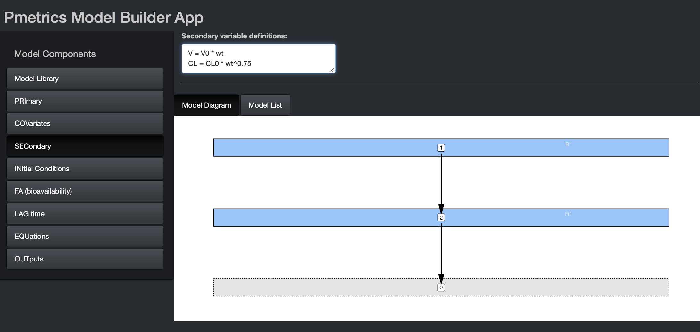

```{r setup, include=FALSE, context="server"}
library(learnr)
library(LearnPM)
library(Pmetrics)
library(tidyverse)

knitr::opts_chunk$set(echo = TRUE)
#wd<-tempdir()

#run_wd = paste0(wd,"/Runs")
#dir.create(run_wd)

exData <- dataEx
mod1 <- modEx
exFit <- PM_fit$new(model = modEx, data = dataEx)

#exData$write("data.csv")
#file_content <- readLines("data.csv")
#file_content <- file_content[-1]
#writeLines(file_content, "data.csv")
#mod1$write("model.txt")
```

### Model Library


The easiest way to build models is to use the Pmetrics Model Builder
[App](https://lapkb.github.io/Pmetrics/reference/build_model.html).
It can't be displayed within this tutorial, but you can keep the
tutorial open while you play with the app. To launch the app, type the
following into your console: `build_model(exData)`. This will start
the app with sample data that is the same as what we created with
`exData`. When you launch it, the first page you'll see is below.

Navigate with the model components sidebar.

```{r echo = FALSE, out.width="75%", out.height="75%"}
knitr::include_graphics("images/model_builder/front.png")
```

Here you can choose from pre-existing models, either which you have
created yourself and load with the Previous Model dialogue, or from the
Pmetrics Model Library. Use the filters and description search to help
select the model you want. Matching models will update in the box at the
bottom. If you select one, you'll see a model snapshot on the right.

In the snapshots, B is for bolus inputs, R is for Rate infusions (e.g.
intravenous infusions), and Y is for observations. Arrows indicate the
flow of drug. The grey compartment 0 is the environment.

Once you choose a model, hit the "Select" button at the bottom to
populate remaining model components. Similarly, if you load a Previous
Model, model components will be appropriately populated.

**For this tutorial, choose the model with oral absorption and two
compartments as shown in the snapshot above.**

#### PRImary

```{r echo = FALSE, out.width="75%", out.height="75%"}
knitr::include_graphics("images/model_builder/primary.png")
```

In this tab, you can choose the number and names of the primary
parameters. These are the parameters for which value probability
distributions will be estimated. You can specify initial values as
ranges or mean/SD. The mean is the mid point of a range and the SD is
1/6 of the range, i.e. 3 SD above and below the mean. If you omit the
second value for a parameter (Max or SD), the parameter will become
"fixed", i.e. unknown value but zero variance in the population. In
other words Pmetrics will estimate the value but make it the same for
the whole population. The value you provide will be the starting
estimate. If you check the constant option, it will fix the parameter to
your value for every subject and not estimate. The GTZ option keeps the
parameter positive, which is only relevant for parametric analysis,
since nonparametric will respect parameter ranges strictly.

In the bottom you see the Model Diagram and the Model List. These
dynamically build as you complete the Model Components. More about them
later.

**Make your PRImary component match the image in the tutorial.**

#### COVariates

```{r echo = FALSE, out.width="75%", out.height="75%"}
knitr::include_graphics("images/model_builder/covariates.png")
```

If you launch the Model Builder with a [`PM_data`](https://lapkb.github.io/Pmetrics/reference/PM_data.html) object as an argument,
the covariate tab will be pre-populated with the covariates in the data
file, as above. You can select any of them to make them piece-wise
constant, i.e. the value is held constant between measurements. If left
unchecked, covariate values will be linearly interpolated between
measurements.

**Make your COVariate component match the image in the tutorial.**

```{r quiz, echo = FALSE}

question("Which of the following covariates in a model of ceftazidime in intermittent hemodialysis would be most likely to be checked as piece-wise constant?",
         answer("weight"),
         answer("dialysis", correct = TRUE),
         answer("creatinine"),
         answer("potassium"),
         correct = "Yes, dialysis can be turned on or off with 1 or 0 values which will be constant until changed.",
         incorrect = "No, try again. This covariate should be allowed to change between measurements.",
         allow_retry = TRUE
)

```

#### SECondary

```{r echo = FALSE, out.width="75%", out.height="75%"}

```

Secondary variables are those that are defined by equations that are
combinations of primary, covariates, and other secondary variables. If
using secondary variables, define them first within this block. It is
permissible to have conditional statements, but because expressions in
this block are translated into variable declarations, expressions other
than of the form "X = function(Y)" must be on a new line, prefixed by
"&" and contain only variables which have been previously defined in the
Primary, Covariate, or Secondary blocks.

The image shows examples of secondary variable declarations without
conditions. Here are two examples of conditional secondary variables
chosen on the basis of sex. The primary variables are Vm, Vf, CLm, and
CLf.

```
V = Vm
&IF(sex == 1) V = Vf

V = Vm
CL = CLm
&IF(sex == 1) THEN
V = Vf
CL = CLF
ENDIF
```

**Make your SECondary component blank for the tutorial.**

#### INItial conditions

In this tab you can change the default initial condition of any
compartment from 0 to something else. It can be an equation, primary or
secondary variable, or covariate. We'll discuss more about the interface
in the section on lag times.

#### FA (bioavailability)

In this tab you can change the default bioavailability of any bolus
input from 1 to something else. It can be an equation, primary or
secondary variable, or covariate. We'll discuss more about the interface
in the section on lag times.

#### LAG time

```{r echo = FALSE, out.width="75%", out.height="75%"}
knitr::include_graphics("images/model_builder/lag.png")
```

In this tab you can change the default delay in absorption of any bolus
input from 0 to something else. It can be an equation, primary or
secondary variable, or covariate. If you wish to use any of the latter
three, select them from the drop down and the equation will
pre-populate, as shown in the image. You can edit the equation or write
your own equation. This is true for initial conditions and
bioavailability in their tabs.

**Make your LAG time component match the image in the tutorial.**

#### EQuatioNs

```{r echo = FALSE, out.width="75%", out.height="75%"}
knitr::include_graphics("images/model_builder/eqn.png")
```

Here you specify the equations that define the structural model, i.e., the
mathematical expressions that relate input (dose) to output (measurements).
Use `dX[i]` for change in compartment amounts, where i is the compartment number,
e.g. dX[1] or dX[2]. Compartment amounts are referred to as `X[i]`, e.g. X[1] or X[2].
Use `BOLUS[j]` for bolus input j and `RATEIV[k]` for infusion k.
j and k correspond to the INPUT column in the data file, which is usually omitted and assumed to be 1 for all doses. The _DUR_ column in the data file determines whether a dose is treated as a BOLUS (DUR = 0) or RATEIV (DUR > 0). Any variable defined in PRI, COV, or SEC may be used in your equations.

```{r quiz_eqn, echo = FALSE}

question_radio("Which equation would not appear in a model with absorption from an oral dose into a central
compartment, intravenous infusion into the central compartment, and distribution between
the central compartment and a peripheral compartment?",
answer("dX[1] = BOLUS[1] - Ka\\*X[1]"),
answer("dX[2] = RATEIV[1] - (Ke + KCP)\\*X[2] + KCP\\*X[3]"),
answer("dX[3] = KCP\\*X[2] - KPC\\*X[3]"),
answer("dX[4] = Ke\\*X[2]", correct = TRUE),
allow_retry = TRUE,
random_answer_order = TRUE
)

```

**Make your EQN component match the image in the tutorial.**

#### OUTputs

```{r echo = FALSE, out.width="75%", out.height="75%"}
knitr::include_graphics("images/model_builder/output.png")
```

Output equations define the relationship between a compartment amount and a measured
value. For drugs, that will usually be in the form of X[.] divided by the volume
for that compartment, where "." is again the compartment number. Write the specific equation
in the appropriate field in this tab. Output numbers correspond to the `outeq` column
of the data file, which might be missing (and assumed to be 1) when only only one output
equation is needed.

Every output equation must have an associated set of error polynomial coefficients
to describe the assay noise associated with measuring that ouput. See the article
on [models](https://lapkb.github.io/Pmetrics/articles/models.html) for more details.
The default behavior is to use the coefficients
in the data file if they exist, and only if absent use these coefficients here.
The "Use always?" option overrides this default to use these coefficients regardless
of what is in the data file.

Currently, you can model residual noise as additive (lambda) or multiplicative (gamma),
with a starting value for the optimization. Alternatively, you can fix the noise term.

**Make your OUT component match the image in the tutorial.**
