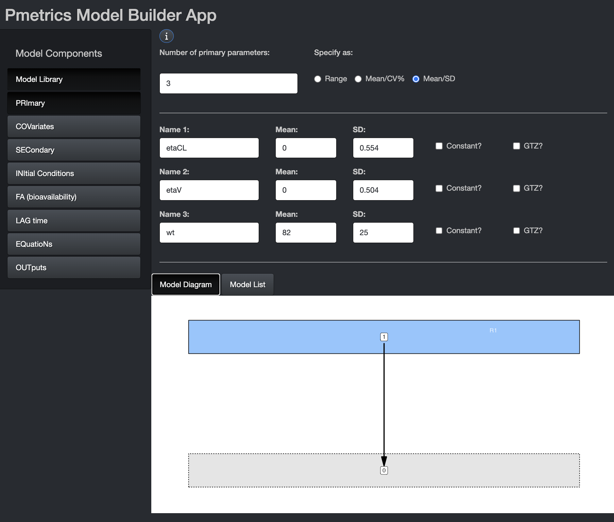
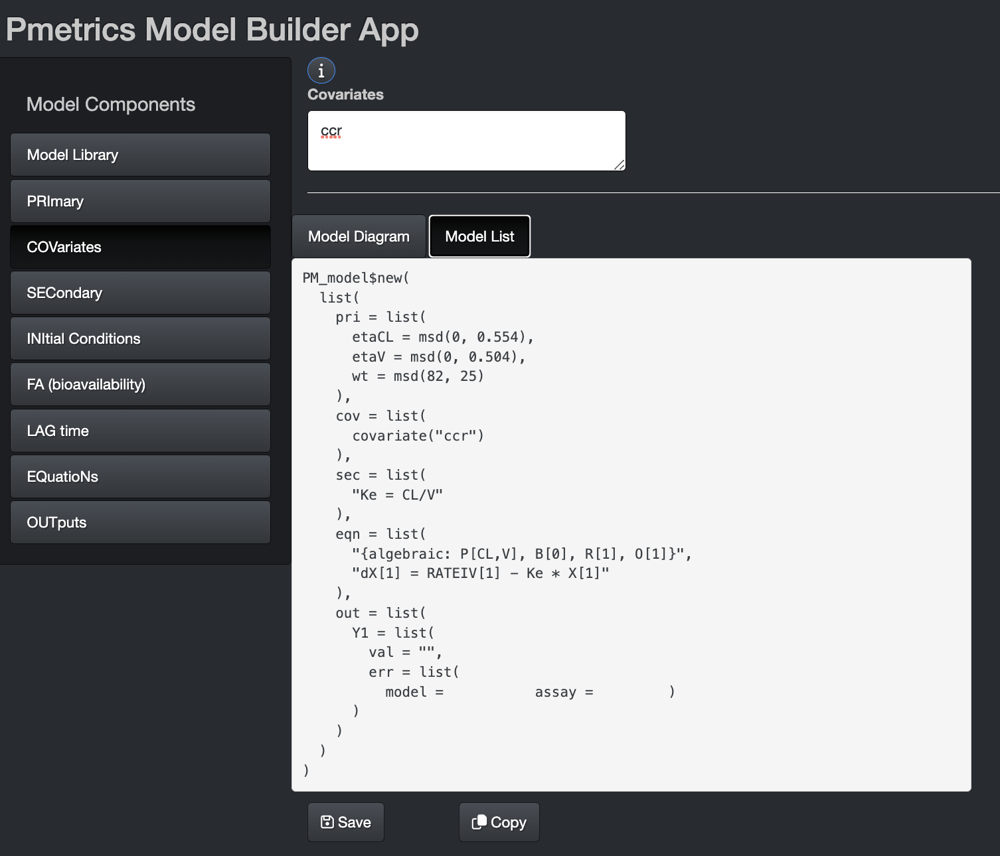
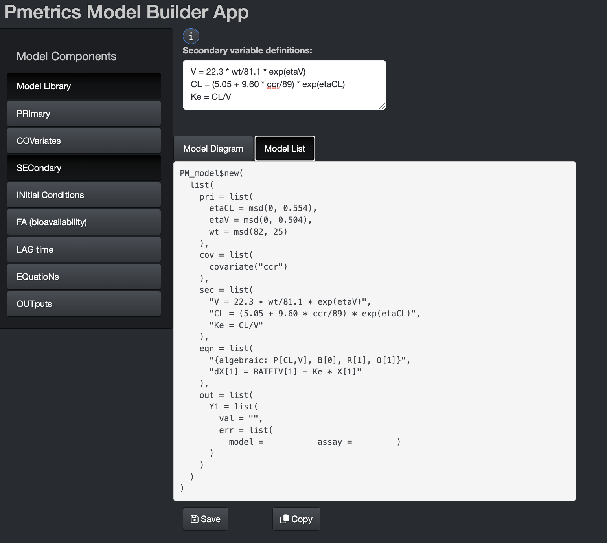
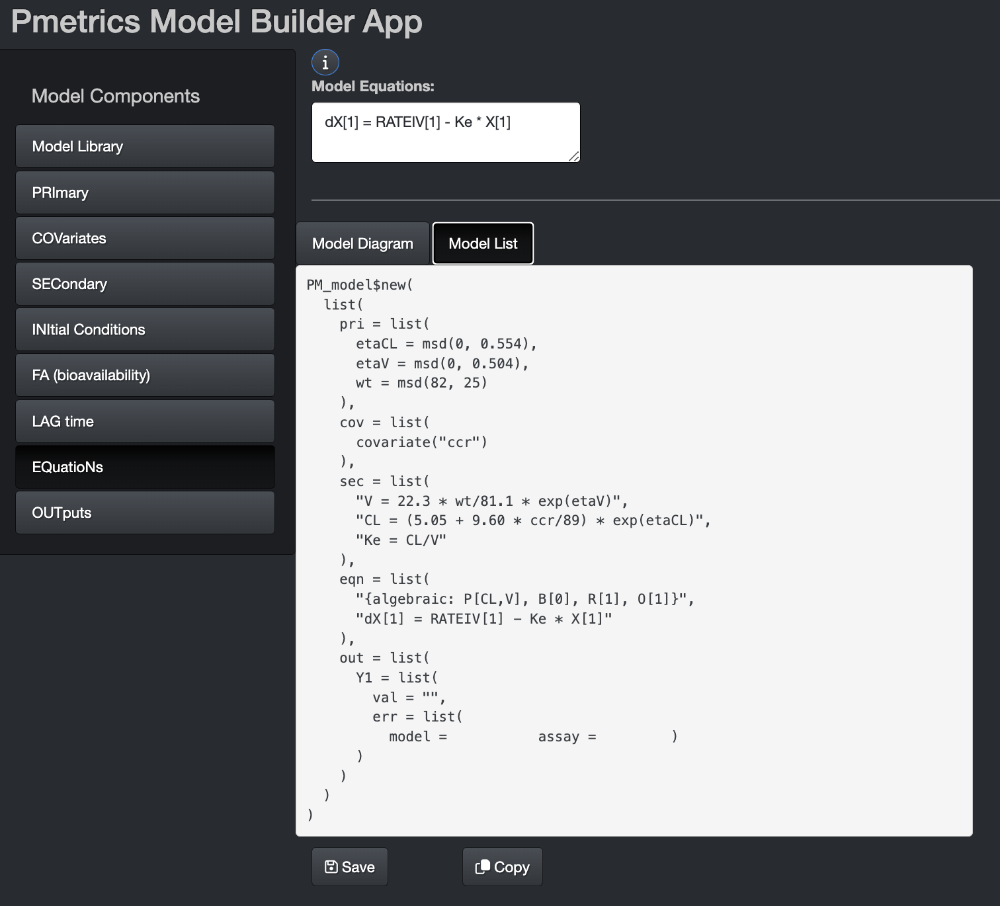
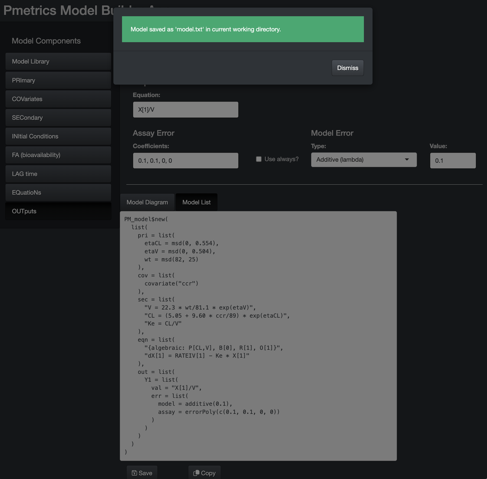

```{r setup, include=FALSE}
library(learnr)
library(LearnPM)
library(Pmetrics)
knitr::opts_chunk$set(echo = FALSE)
mod1 <- PM_model$new(
  list(
    pri = list(
      etaCL = msd(0, 0.554),
      etaV = msd(0, 0.504),
      wt = msd(82, 25)
    ),
    cov = list(
      covariate("ccr")
    ),
    sec = list(
      "V = 22.3 * wt/81.1 * exp(etaV)",
      "CL = (5.05 + 9.60 * ccr/89) * exp(etaCL)",
      "Ke = CL/V"
    ),
    eqn = list(
      "{algebraic: P[CL,V], B[0], R[1], O[1]}",
      "dX[1] = RATEIV[1] - Ke * X[1]"
    ),
    out = list(
      Y1 = list(
        val = "X[1]/V",
        err = list(
          model = additive(0.1),
          assay = errorPoly(c(0.1, 0.1, 0, 0))
        )
      )
    )
  )
)

dat <- PM_data$new()$
  addEvent(id = 1, time = 0, dose = 4000, dur = 0.5, addl = 6, ii = 8, wt = -1, ccr = 90)$
  addEvent(id = 1, time = 72, out = -1)$
  addEvent(id = 2, time = 0, dose = 4000, dur = 4, addl = 6, ii = 8, wt = -1, ccr = 90)$
  addEvent(id = 2, time = 72, out = -1)$
  addEvent(id = 3, time = 0, dose = 12000, dur = 24, addl = 1, ii = 24, wt = -1, ccr = 90)$
  addEvent(id = 3, time = 72, out = -1, validate = TRUE, quiet = TRUE)

```
## Foundations

This tutorial was designed to accompany a workshop, but may be completed independently. We assume that you have completed several tasks.

1. Installed R, Rstudio, and Pmetrics.
- You have also run `PMbuild()` to compile the Pmetrics package.
- If you need help with this, we have assembled detailed [instructions](http://www.lapk.org/Pmetrics_install.php).
2. Completed the [pre-workshop exercises](http://www.lapk.org/workshop/July2023/Pre-Workshop.html). 
- You should have created a folder in your hard drive to store your Pmetrics projects. The suggested locations are "C:\\Pmetrics" for Windows users or "~/Pmetrics" for Mac/Linux users.
- You should have loaded the Pmetrics library in R with `library(Pmetrics)` and created a *Workshop* folder within your *Pmetrics* folder using `PMtree("Workshop")`.
- Your *Workshop* folder will contain subfolders as described in the help for [PMtree](https://lapkb.github.io/Pmetrics/reference/PMtree.html).

**Let's get started!**

## Source: Primary parameters

Review the piperacillin PopPK model from Li et al., JAC 2005. The following R code included in the LearnPM package will open the pdf in your default viewer. In these exercises, we will learn and practice extracting parameters for pharmacometric models from published literature.

``` {r open-pdf, exercise = TRUE}
pkgPDF("Li_JAC_2005.pdf")
```

### Quiz
``` {r extraction-quiz}
quiz(
  caption = "Extracting from a paper",
  question("How many compartments do the authors report for the final model?",
           answer("1", correct = TRUE),
           answer("2"),
           answer("3"),
           allow_retry = TRUE
  ),
  question("Which are the primary (typical) parameters in the model? Hint: refer to Table 2.",
           answer("CL"),
           answer("CL_slope", correct = TRUE),
           answer("CL_int", correct = TRUE),
           answer("V"),
           answer("V_slope", correct = TRUE),
           answer("V_int"),
           answer("CCR"),
           answer("All"),
           allow_retry = TRUE,
           try_again = "Incorrect. Figure out the names corresponding to each of the $\\theta$ parameters."
  ),
  question("What type of distribution do the interindividual random parameter (eta, $\\eta$) values have?",
           answer("Normal"),
           answer("Log-normal", correct = TRUE),
           allow_retry = TRUE),
  question("Which primary parameters have interindividual variance?",
           answer("$\\theta_1$ (CL_int)"),
           answer("$\\theta_2$ (CL_slope)", correct = TRUE),
           answer("$\\theta_3$ (V_slope)", correct = TRUE),
           allow_retry = TRUE
  )
)
```

Know that $\omega$ is the standard deviation of $\eta$. To derive $\omega$ from CV%, use the approximation $\omega = CV\%$ when CV% is small (<50%), or the more exact formula  $\omega = \sqrt{log((\frac{CV\%}{100})^2 + 1)}$.

Again using Table 2, let's extract the correct values for our simulations with piperacillin. We'll use clearance as the example, but the same will apply to volume.

### Quiz

``` {r theta-cl}
quiz(caption = "Extracting necessary values",
     question("What is the typical value of $\\theta_1$ (CL_int)?",
              answer("5.05", correct = TRUE),
              type = "learnr_text",
              incorrect = "It should be 5.05."
     ),
     question("What is the typical value of $\\theta_2$ (CL_slope)?",
              answer("9.60", correct = TRUE),
              type = "learnr_text",
              incorrect = "It should be 9.60."
     ),
     question("What is the value of $\\omega$ for the standard deviation of the $\\eta$-distribution around $\\theta_2$? Hint: use the approximation formula above and the reported CV%. Round to three decimal places.",
              answer("0.277", correct = TRUE),
              type = "learnr_text",
              incorrect = "It should be 0.277.",
              correct = "Yes! It is simply the CV%/100."
     )
)
```

## Source: Covariates

It's important to include covariate relationships with model parameters. The paper by Liu et al has relationships between covariates and two primary model parameters.

### Quiz 
``` {r covariate-question}
question("Try writing the equation from the paper that relates body weight to
volume. Use *V* for volume, *V_slope* for $\\theta_3$ and *WT* for weight. Spacing and case don't matter.", type = "learnr_text",
answer_fn(\(x){
  x2 <- stringr::str_replace_all(x, "\\s+", "") 
  if(!is.na(stringr::str_extract(x2, stringr::regex("V=V_slope\\*WT/81.8", ignore_case = TRUE)))){
    return(correct())
  }
  return(incorrect())
}),
allow_retry = TRUE,
correct = "That is right.",
incorrect = "Make sure you have named variables as in the instructions. Also ensure that you have normalized WT."
)
```

Obviously there is a similar equation for Clearance.

## Define simulation goals

Here we have no quizes, but we want to test three different piperacillin dosage regimens for how well they achieve desired concentration profiles in the population. 

To do this, we are going to simulate steady-state PK profiles based on the piperacillin model in populations with:

* 3 piperacillin dosage regimens in 1000 subjects each
- 4g q8h (30 min infusion)
- 4g q8h (4h infusion)
- 12g continuous infusion
* Fixed, normal renal function (90 mL/min)
* Variable (random) weights with mean 82 kg, SD 25 kg

## Create the data template

There are two ways to create the data template. The first is to use a spreadsheet program like Excel. The second is to create a template on the fly in R. Let's look at both methods.

Be sure to look at the article on Pmetrics [data objects](https://lapkb.github.io/Pmetrics/articles/data.html) for details on the column headers and meanings of the columns.

### Option 1: Create in spreadsheet program

1. Open the program, e.g. Excel.
2. Name your columns: ID, TIME, DOSE, DUR, ADDL, II, OUT, CCR. We are not including WT as a covariate because we will simulate it.
3. Make 3 subjects, each with the following.
- A DOSE at TIME 0 according to our goal doses
- A DUR according to the duration of the infusion
- The right number of ADDL doses so that the last dose is given at TIME = 48 with dosing at an appropriate II interval. For the continuous infusion, give one dose at time 0, DUR = 24, ADDL = 1, II = 24.  
- Follow the dosing by one OUT with value -1 at time 72 (24 hours after the last dose)
- Fill in CCR = 90 in every row.
4. Save the file as "pip.csv". If you made a `/src` folder in the pre-workshop exercises, put the file there. If your spreadsheet uses semicolons (;) as field separators, you'll need to update Pmetrics with `setPMoptions(sep = ";")`.

### Option 2: Create in R

Try your hand at building a data object using `PM_data$new()` and `$addEvent()`. Inspect the code below so that you understand it will create a record at time 0 for subject ID 1, add a DOSE of 4000 mg infused over DUR 0.5 hours with 6 ADDL doses given at an II of every 8 hours, CCR = 90. The final line will print the object. Press the **Run Code** button to see the output.

```{r dataCreate, exercise = TRUE}
dat <- PM_data$new()$
  addEvent(id = 1, time = 0, dose = 4000, dur = 0.5, addl = 6, ii = 8, ccr = 90)
dat$print(viewer = FALSE)
```

Next, build upon the prior exercise to edit the code below and add one OUT = -1 for ID 1 at TIME 72. Press the **Run Code** button to see the output when you are done.

```{r dataAdd, exercise = TRUE}
#Add the new event to the end of this code
dat <- PM_data$new()$
  addEvent(id = 1, time = 0, dose = 4000, dur = 0.5, addl = 6, ii = 8, ccr = 90)

#Print the result
dat$print(viewer = FALSE)

```

```{r dataAdd-solution}
dat <- PM_data$new()$
  addEvent(id = 1, time = 0, dose = 4000, dur = 0.5, addl = 6, ii = 8, ccr = 90)$
  addEvent(id = 1, time = 72, out = -1)
```

Continue to build the object to add the second template subject, who gets a dose 4000 mg every 8 hours but by a 4 hour infusion instead of 30 minutes. Hint, copy your code from above and edit as needed. Add both the doses and the out in the same step. The only difference between ID 1 and 2 should be DUR.

```{r dataAdd2, exercise = TRUE}
#Add your code here


#Print the result
dat$print(viewer = FALSE)

```

```{r dataAdd2-solution}
dat <- PM_data$new()$
  addEvent(id = 1, time = 0, dose = 4000, dur = 0.5, addl = 6, ii = 8, ccr = 90)$
  addEvent(id = 1, time = 72, out = -1)$
  addEvent(id = 2, time = 0, dose = 4000, dur = 4, addl = 6, ii = 8, ccr = 90)$
  addEvent(id = 2, time = 72, out = -1)
```

Lastly, add the final subject template (ID = 3) who gets 12000 mg daily by continuous infusion. Again, copy your code from above, paste it below and edit. Use `validate = TRUE` in the last call to `addEvent()` to ensure that you have made a valid Pmetrics data object.

```{r dataAdd3, exercise = TRUE}
#Add your code here


#Print the result
dat$print(viewer = FALSE)

```

```{r dataAdd3-hint-1, results='asis'}
addEvent(..., dur = 24, addl = 1, ii = 24,...)
#Next hint is the solution.
```

```{r dataAdd3-hint-2}
dat <- PM_data$new()$
  addEvent(id = 1, time = 0, dose = 4000, dur = 0.5, addl = 6, ii = 8, ccr = 90)$
  addEvent(id = 1, time = 72, out = -1)$
  addEvent(id = 2, time = 0, dose = 4000, dur = 4, addl = 6, ii = 8, ccr = 90)$
  addEvent(id = 2, time = 72, out = -1)$
  addEvent(id = 3, time = 0, dose = 12000, dur = 24, addl = 1, ii = 24, ccr = 90)$
  addEvent(id = 3, time = 72, out = -1, validate = TRUE)
```

**As final steps**, please do the following.

1. Open the *Workshop.R* file in the *Rscript* folder of the *Workshop* project folder you made with `PMtree` previously. This file is designed to get you started building a model from data. In this case, we are developing simulations from the literature. 
2. Copy and paste your full data template creation code into your Rscript and save it.
3. You can also copy and paste the file you made in Option 1 into the *Sim* folder. Call that file "simtpt.csv", short for "simulation template".
4. In your *Workshop.R* script, save the object you created as a second template file.
- Change the working directory with `setwd()`. 
* You can first execute line 6 to change the working directory to the *Runs* folder in your project. 
* Then use this command to switch to the *Sim* folder: `setwd("../Sim")`
- Use `dat$write("simtpt2.csv")` to save the `PM_data` object you made into the *Sim* folder of your project.
5. Compare "simtpt.csv" and "simtpt2.csv". Are they the same? How are they different?

## Build the model

### Choosing the structural model

We need to decide on the equations for the model that relate input (dose) to output (concentration). That will either be a set of equations with an algebraic solution or a set of ordinary differential equations (ODEs). An algebraic solution means that the computer can calculate the concentration at any given time with simple algebra and not needing to use a differential equation solver. 

### Quiz

```{r stuctural-model}
question("Does this model use algebraic equations or ODEs?",
         answer("Algebraic", correct = TRUE),
         answer("ODEs")
)
```

For this portion of the tutorial, we will use the model builder app in Pmetrics. 

1. Ensure that Pmetrics is loaded in R with `library(Pmetrics)`. This is the first line of code in your *Workshop.R* file in your project tree.
2. Use `build_model()` to launch the app.
3. Choose the library model with CL and V and one compartment. Hit the "Select" button.
4. Let's visit each section in turn.

### Choosing primary parameters

First, we need to decide how many primary parameters are in the model.

### Quiz

```{r pri}
question("How many primary parameters are there?",
         answer(1),
         answer(2),
         answer(3, correct = TRUE),
         answer(4),
         answer(5),
         allow_retry = TRUE,
         incorrect = "Hint: how many random variables do we want to simulate?",
         correct = "Yes, we have 3 random variables to simulate, but read the section below on trickiness."
)
```

<details>
<summary>Primary parameter trickiness</summary>
In reality, although we indeed want to simulate **3** primary parameters, in this case they do not correspond to the $\theta$ values exactly. We are trying to simulate the *random* parameters $\eta_1$ and $\eta_2$, which have means of 0 and standard deviations of $\omega_1$ and $\omega_2$. The third random parameter is weight in our simulations. The $\\theta$ values are actually fixed. We will need to account for them in the model equations, but not simulate them as random variables. 
</details>

### Specifying parameter values

The Pmetrics simulator always simulates from normal distributions with a mean and standard deviation. It is possible to log-transform parameter values, and in fact we will do that in this model. 

1. On the Primary Parameters tab of the app, name your 3 variables:
* etaCL
* etaV
* wt
2. Choose to specify as mean/SD.
3. Use a mean of 0 for both etaCL and etaV. 
4. For standard deviation, go back to your second quiz and recall the value you found for $\omega_CL$. Multiply that number by 2 to allow for a wider simulation range and enter it for the SD on etaCL.
5. Do the same calculation for the SD on etaV.
6. For weight, enter mean 82 kg, SD 25 kg.

<details>
<summary>Check your work</summary>
```{r echo = F}

```
</details>

### Specifying covariate relationships

Although the model by Li et al includes weight (WT) and creatinine clearance (CCR) as covariates, we are going to make weight a simulated value and fix CCR to 90 for all subjects in the model. You already made a data object with CCR as the covariate.

Now, learn how to make the accompanying model, continuing in the model builder app from the previous exercise.

1. Move to the COVariates tab on the left side of the app.
2. Click the "i" button at the top for information. 
- Since you launched the app without passing a model or data object as an argument, there were no pre-loaded covariates.
- Follow the instructions to add `ccr` as a covariate.
- Watch how the Model List changes in the bottom window. Make sure you have that tab selected. 
- If you like you can make it piece-wise constant by typing `ccr!` instead, and the Model List will update. Change it back to `ccr`.
- We don't add WT as a covariate, because we already added it as a primary parameter to be simulated.

<details>
<summary>Check your work</summary>
```{r echo = F}

```
</details>  

### Defining secondary equations

The SECondary tab is where we define the relationships between primary parameters and between those parameters and covariates. You'll notice that the model already has a secondary equation `Ke = CL/V`. This is because Pmetrics is looking for specifically named parameters to understand if it can solve the model without differential equations. In this case, it knows that this one-compartment IV model should have a Ke, but because we chose the model with clearance, it writes the equation to derive Ke from CL.

However, we have not yet defined either CL or V. We have etaCL and etaV. Look again at the paper by Li. We know that the $\eta$ values are log-normally distributed. This means that the equation for a parameter is $TV*e^\eta$ and $TV$ is a combination of $\theta$s and covariates. For CL, $TV_{CL}=\theta_1 + \theta_2*CCR/89$, which we see in Table 2. For V, $TV_V=\theta_3*WT/81.8$.

The secondary equation for volume is then `V = 22.3 * WT/81.1 * exp(etaV)`. We saw something similar to this in an earlier Quiz.

### Quiz

```{r sec-cl}
question("Try writing the equation for clearance.
Use *CL* for clearance, and *ccr* for creatinine clearance. Spacing and case don't matter.", type = "learnr_text",
answer_fn(\(x){
  x2 <- stringr::str_replace_all(x, "\\s+", "") 
  if(!is.na(stringr::str_extract(x2, stringr::regex("CL=\\(5\\.05\\+9\\.60\\*ccr/89\\)\\*exp\\(etaCL\\)", ignore_case = TRUE)))){
    return(correct())
  }
  return(incorrect())
}),
allow_retry = TRUE,
correct = "That is right. Well done!",
incorrect = "Make sure you have named variables as in the instructions. Also ensure that you have normalized ccr. Don't forget to multiply the TV by exp(eta)."
)
```

<details>
<summary>I give up, show me the answer.</summary>
CL = (5.05 + 9.60 \* ccr/89) \* exp(etaCL)
Don't feel bad if you didn't get it. Pharmacometrics is very detail oriented and your skills will improve with practice!
</details>

Add these equations to the definition block and watch the Model List evolve. **Note:** Put the equations for V and CL before the equation for Ke, so that Pmetrics knows what CL and V are by the time it reaches Ke.

<details>
<summary>Check your work</summary>
```{r echo = F}

```
</details> 

### Equations

The good news is that there isn't anything for you to do on the EQuatioN tab! Pmetrics has added a differential equation which you can see in both the Model Equations box and in the `eqn` block of the Model List below. 

However, you can also see a "token" in the Model List that indicates this model will be solved algebraically. The differential equation is only for the purposes of structural model plotting in the diagram and for transparency, since algebraic solutions for models with more than one compartment are quite difficult to interpret. In contrast, once you are used to looking at pharmacokinetic/pharmacodynamic model differential equations, you can rapidly understand the structure. For more details on the token, you can read our article on [Models](https://lapkb.github.io/Pmetrics/articles/models.html).

Note that this model is very simple structurally, being only one compartment with no oral dosing. You can click the "i" button to understand more about how to write differential equations if you build your own model from scratch. All that work with $\theta$s and $\eta$s has paid off and the model equation reduces to a single parameter Ke!

Below is what your app should look like at this point. Now is a good time to check and make sure you're on track!

```{r echo = F}

```

### Outputs

Lastly we come to the outputs, where we define in the model how to calculate our observations, which are typically drug concentrations or effects.

You can click on the "i" button for more information on how to write these output equations, but Pmetrics has already completed one for you based on the model you chose.

There is also nothing for you to do here because Pmetrics knows how to define the output based on the model you selected from the library. The fields related to assay and model error are more relevant when you are trying to fit models to data, rather than simulating. They describe how observations are weighted in the fitting process (assay noise) as well as additional noise (model error) associated with model misspecification and in the data (e.g. small errors in recorded sample times). Again, for more details refer to  [Models](https://lapkb.github.io/Pmetrics/articles/models.html).

These are not used for simulation although as we'll see, there are options to add noise to simulated inputs and outputs.

## Saving and copying the model

### Saving

At last you are ready to use the model! First, click the "Save" button. If your model is correctly constructed you will see the gratifying green pop-up below.

```{r echo = F}

```

A file named "model.txt" is saved in your current working directory. You can double check this in R with `getwd()`. 


In your Mac Finder, Windows Explorer, or Linux File Manager, copy "model.txt" from its folder into the /src folder of your Workshop project.

### Copying

Click the "Copy" button at the bottom of the model building app. Add the following code to your Workshop.R script in Rstudio: `mod1 <- `.

Then paste next to the assignment operator (`<-`). Including the data template we made earlier, your script should look like this. **Be sure to save your script.**

```{r mod-script, echo = TRUE, eval = FALSE}
#make the data
dat <- PM_data$new()$
  addEvent(id = 1, time = 0, dose = 4000, dur = 0.5, addl = 6, ii = 8, wt = -1, ccr = 90)$
  addEvent(id = 1, time = 72, out = -1)$
  addEvent(id = 2, time = 0, dose = 4000, dur = 4, addl = 6, ii = 8, wt = -1, ccr = 90)$
  addEvent(id = 2, time = 72, out = -1)$
  addEvent(id = 3, time = 0, dose = 12000, dur = 24, addl = 1, ii = 24, wt = -1, ccr = 90)$
  addEvent(id = 3, time = 72, out = -1, validate = TRUE)

#define the model
mod1 <- PM_model$new(
  list(
    pri = list(
      etaCL = msd(0, 0.554),
      etaV = msd(0, 0.504),
      wt = msd(82, 25)
    ),
    cov = list(
      covariate("ccr")
    ),
    sec = list(
      "V = 22.3 * wt/81.1 * exp(etaV)",
      "CL = (5.05 + 9.60 * ccr/89) * exp(etaCL)",
      "Ke = CL/V"
    ),
    eqn = list(
      "{algebraic: P[CL,V], B[0], R[1], O[1]}",
      "dX[1] = RATEIV[1] - Ke * X[1]"
    ),
    out = list(
      Y1 = list(
        val = "X[1]/V",
        err = list(
          model = additive(0.1),
          assay = errorPoly(c(0.1, 0.1, 0, 0))
        )
      )
    )
  )
)
```

## Building the prior for simulation

We have the model; we have the data template. Let's turn our attention to the command to execute the simulator.

The final mandatory item to run the simulator is a definition of the parameter value distributions from which to draw samples. This is called `poppar`, which is a list of three elements.

* **wt** The weights of distributions in a mixture model. Typically, especially if simulating from the literature, there will only be one value, which will be 1. If there were two distributions, i.e. a bimodal parameter, then this element would have two numbers with the relative weights of each mode, summing to 1, e.g. `c(0.4, 0.6)`.
* **mean** A vector of mean values for each random parameter in the model. If `length(wt) > 1` then this will be a matrix, with each row containing the mean parameter values for each mode.
* **cov** The covariance matrix. Diagonal elements are the variances for the parameters, and off-diagonal are the co-variances. If there is more than one mode, then this is just the overall covariance, i.e. there is still only one matrix. If simulating from the literature, the co-variances are usually zero as they are not supplied. In that case, a convenvient way to make a diagonal matrix in R, with off-diagonal values = 0 is as follows.

```{r echo = T, eval = TRUE}
diag(c(0.25, 625))
```

Let's think about how to build `poppar` for our simulation, based on the values in Li et al. **Note:** For the random parameter variances, it's not a bad idea to increase them to allow for the possibility of parameter values beyond the original population. In the questions below, be sure to double the standard deviation of the random parameters before you calculate the variances by squaring them.

```{r poppar-quiz}
quiz(
  caption = "Building `poppar`",
  question("Which `wt` should you use?",
           answer("`wt = 1`", correct = TRUE),
           answer("`wt = c(0.5, 0.5)`"),
           answer("`wt = 82`"),
           answer("`wt = c(0.3, 0.7)`"),
           answer("None of these"),
           correct = "Yes, the distribution for the parameter values is unimodal, so wt = 1.",
           incorrect = "Hint: how many mean values are there for each random parameter?",
           allow_retry = TRUE
  ),
  question("What values of `mean` should you use? Refer to Table 2 in Li.",
           answer("`mean = c(5.05, 9.6, 22.3)`"),
           answer("`mean = c(22.7, 25.2, 18.5)`"),
           answer("`mean = c(0, 0, 82)`", correct = TRUE),
           answer("None of these"),
           correct = "Yes! We are looking for the means of $\\eta_{CL}$, $\\eta_V$ and WT. Good job.",
           incorrect = "Not quite. Go back to prior exercises and remember what the random parameters are.",
           allow_retry = TRUE
  ),
  question("The covariance matrix will have non-zero off-diagonal values.",
           answer("TRUE"),
           answer("FALSE", correct = TRUE),
           correct = "Correct. We have no data about correlations between parameters, so the off-diagonal co-variances are zero.",
           incorrect = "Well, we have no data about correlations between parameters...",
           allow_retry = TRUE
  ),
  question("What is the right code for the covariance matrix?",
           answer("`cov = diag(c(5.05, 9.60, 22.3)`"),
           answer("`cov = diag(c(0.277, 0.252, 25)`"),
           answer("`cov = diag(c(0.277^2, 0.252^2, 25^2)`"),
           answer("`cov = diag(c((2*0.277)^2, (2*0.252)^2, (2*25)^2)`", correct = TRUE),
           correct = "Nice job. You remembered to double the standard deviations before squaring them.",
           incorrect = "Don't forget you need to focus on standard deviation of each random parameter ($\\omega$$), double it, and then sqaure it."
)
)
```

You now should have enough information to build `poppar`. Replace the missing values with the correct ones. The "Run Code" button won't do anything, but you can check your answer by clicking the "Solution" button.

```{r poppar-build, exercise = TRUE}
poppar <- list(wt = NA, mean = c(NA, NA, NA), cov = diag(c(NA, NA, NA)))
```

```{r poppar-build-solution}
poppar <- list(wt = 1, mean = c(0, 0, 82), cov = diag(c((2*0.277)^2, (2*0.252)^2, (2*25)^2)))
```

**Copy the code into your Rscript.**


## Simulator command

At last we are ready to simulate. As described in [Simulation](https://lapkb.github.io/Pmetrics/articles/simulation.html) vignette, there are two ways to run the simulator. 

* If starting from the results of a population analysis, e.g. with NPAG or IT2B
```{r echo = TRUE, eval = FALSE}
run1 <- PM_load(1)
sim1 <- run1$sim(...)
```
* Otherwise, use this construct.
```{r echo = TRUE, eval = FALSE}
sim1 <- PM_sim$run(poppar, model, data,...)
```
  
The advantage of the first approach is that `poppar` can be obtained from the `PM_final` object inside `run1`, and the model and data are also fields inside `run1`. You can replace the data to use a different template.

However, if you don't have a prior run, such as the case in this workshop where we are simulating from the literature, you need to go with approach two. That's why we've been learning to make the data, model and `poppar`.

The [Simulation](https://lapkb.github.io/Pmetrics/articles/simulation.html) vignette and the help for the underlying simulator function [SIMrun](https://lapkb.github.io/Pmetrics/reference/SIMrun.html) detail all the arguments you can use to change the behavior of the simulator. Here, we'll focus on two:

* limits
* predInt

Limits allows you to truncate the simulation to keep it within the boundaries established. Using a value of `NA` will apply the limits in the model. You can remind yourself of those limits by looking at min and max for each of the primary parameters with this code.

```{r mod1-print, exercise = TRUE}
mod1
```

Using `predInt` is a powerful shorthand for adding simulations/predicitons at defined intervals without having to specify them directly in your data template. This is why we only needed to add one observation event at TIME = 72. The easiest way to use it here is `predInt = 1`, which will generate simulated output every hour from TIME = 0 until the last event in each simulation template, in this case TIME = 72. This way, when you plot the simulated data, you can see the whole profile and easily determine if you are at steady state, for example.

You now have all the arguments for your call to `PM_sim$run()`.

* mod1
* dat
* poppar
* limits
* predInt

Try your best to write the code in your Rscript, Workshop.R. Assign the results to `sim1`.

<details>
  <summary>Check your work.</summary>
  `sim1 <- PM_sim$run(model = mod1, data = dat, poppar = poppar, limits = NA, predInt = 1)`
  
  This assumes you already defined mod1, dat, and poppar using the code that we devloped earlier and copied into Workshop.R.
</details>


